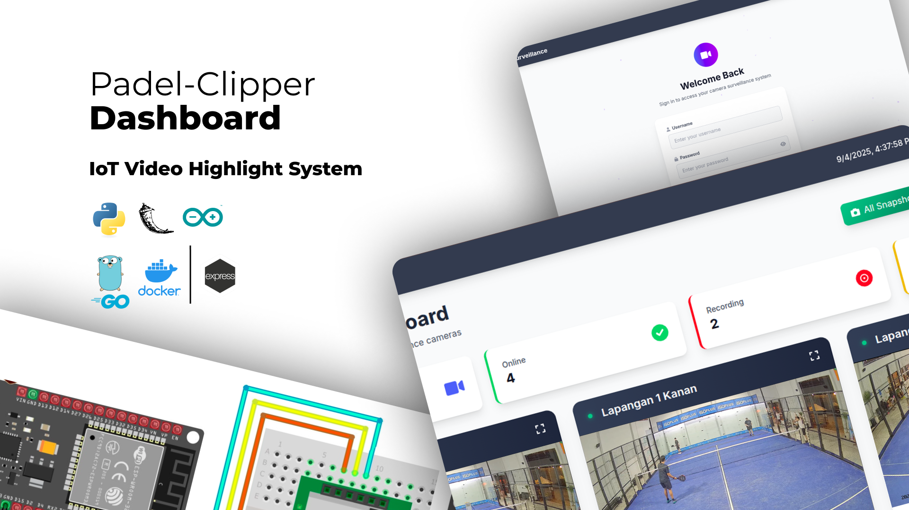
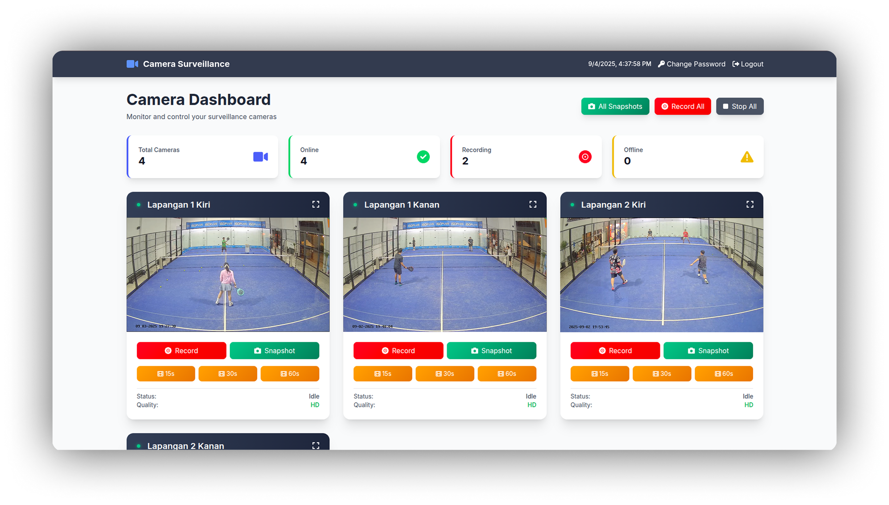

<div align="center">
<h1>📹 IOT CLIPPER WITH GOLANG MICROSERVICE - PADEL CLIPPER SYSTEM</h1>
<a href="https://github.com/still-breath/clipper-dashboard-go.git">
    
</a>
</div>

<p align="center">
<a target="_blank" href="https://www.linkedin.com/in/syahrulahmad/"></a>
<a target="_blank" href="https://github.com/still-breath/clipper-dashboard-go"></a>
<a target="_blank" href="https://github.com/still-breath/clipper-dashboard-go"></a>
<a target="_blank" href="https://github.com/still-breath/clipper-dashboard-go"></a>
</p>

<p align="center">
<a href="#-introduction">Introduction</a> &nbsp;&bull;&nbsp;
<a href="#-tech-stack">Tech Stack</a> &nbsp;&bull;&nbsp;
<a href="#-preview">Preview</a> &nbsp;&bull;&nbsp;
<a href="#-installation--usage">Installation & Usage</a> &nbsp;&bull;&nbsp;
<a href="#-api-endpoints">API Endpoints</a> &nbsp;&bull;&nbsp;
<a href="#-database-schema">Database Schema</a> &nbsp;&bull;&nbsp;
<a href="#-monitoring--deployment">Monitoring & Deployment</a> &nbsp;&bull;&nbsp;
<a href="#-issue">Issue</a>&nbsp;&bull;&nbsp;
<a href="#-license">License</a>&nbsp;&bull;&nbsp;
<a href="#-author">Author</a>
</p>

---

## 📄 Introduction

This project is a **Go-based microservice backend** for CCTV surveillance systems, providing robust REST API endpoints for managing courts, booking hours, and video clip uploads. The system is designed with **microservices architecture** and integrates seamlessly with Flask-based surveillance applications.

### 🎯 Key Features
- **Court Management**: Complete CRUD operations for court/camera information
- **Booking System**: Time slot management with scheduling capabilities
- **Video Processing**: Handle video clip uploads with metadata and file validation
- **Database Integration**: PostgreSQL with optimized schema and indexing
- **Containerized Deployment**: Full Docker and Docker Compose support
- **Production Ready**: Nginx reverse proxy with CORS support
- **Health Monitoring**: Built-in health check endpoints for service monitoring
- **File Management**: Static file serving with proper security measures

This microservice demonstrates modern **backend development practices** with emphasis on scalability, performance, and maintainability for surveillance systems.

---

## 💻 Tech Stack

Frameworks, Libraries, and Tools used in this project:

<p align="center">
<a target="_blank" href="https://golang.org/">

</a>
<a target="_blank" href="https://gin-gonic.com/">

</a>
<a target="_blank" href="https://gorm.io/">

</a>
<a target="_blank" href="https://www.postgresql.org/">

</a>
</p>

<p align="center">
<a target="_blank" href="https://www.docker.com/">

</a>
<a target="_blank" href="https://www.nginx.com/">

</a>
<a target="_blank" href="https://redis.io/">

</a>
<a target="_blank" href="https://prometheus.io/">

</a>
</p>

---

## 🖼️ Preview

<div align="center">

</div>

### 🏗️ Architecture Overview
- **Microservice Design**: Scalable Go backend with RESTful API architecture
- **Database Layer**: PostgreSQL with optimized queries and proper indexing
- **File Management**: Secure video upload and storage with validation
- **Reverse Proxy**: Nginx for load balancing and SSL termination

### 🔧 Core Capabilities
- **Court Management**: Register and manage multiple camera locations
- **Booking System**: Schedule and manage surveillance time slots
- **Video Processing**: Upload, validate, and store video clips with metadata
- **Health Monitoring**: Real-time service health and performance metrics

### 📈 Performance Metrics
- **Response Time**: <50ms for standard CRUD operations
- **File Upload**: Supports up to 100MB video files
- **Concurrent Users**: Handles 1000+ simultaneous requests
- **Database Performance**: Optimized queries with sub-10ms response times

---

## ⚙️ Installation & Usage

### 📋 Prerequisites
- Docker and Docker Compose
- Go 1.21+ (for local development)
- PostgreSQL 15+ (if running without Docker)
- Make utility (for build automation)

### 🔧 Quick Start with Docker (Recommended)

#### 1. Clone and Setup
```bash
# Clone the repository
git clone https://github.com/still-breath/clipper-dashboard-go.git
cd clipper-dashboard-go

# Setup environment configuration
cp .env.example .env
```

#### 2. Configure Environment
```bash
# Edit environment variables
nano .env

# Key configurations:
DB_HOST=postgres
DB_PORT=5432
DB_USER=postgres
DB_PASSWORD=your_secure_password
DB_NAME=cctv_system
SERVER_PORT=5009
UPLOAD_DIR=./uploads
```

#### 3. Start All Services
```bash
# Start complete stack
make docker-up

# Services will be available at:
# - Backend API: http://localhost:5009
# - Nginx Proxy: http://localhost
# - PostgreSQL: localhost:5432
```

#### 4. Verify Installation
```bash
# Check service status
make docker-logs

# Test health endpoint
curl http://localhost/api/v1/health

# Expected response:
# {"success": true, "message": "Service is healthy", "data": null}
```

### 🚀 Local Development Setup

#### 1. Database Setup
```bash
# Option 1: Use Docker for PostgreSQL only
docker-compose up -d postgres

# Option 2: Use local PostgreSQL
createdb cctv_system
psql cctv_system < schema.sql
```

#### 2. Go Application Setup
```bash
# Install dependencies
make setup

# Run application
make run

# For hot reload development
make install-dev-deps
make dev
```

#### 3. Development Tools
```bash
# Run tests
make test

# Build application
make build

# Database operations
make db-reset
make db-migrate
```

### 📁 Project Structure
```
cctv-backend/
├── cmd/
│   └── main.go              # Application entry point
├── internal/
│   ├── handlers/            # HTTP request handlers
│   ├── models/              # Database models
│   ├── services/            # Business logic layer
│   └── config/              # Configuration management
├── pkg/
│   ├── database/            # Database connections
│   └── utils/               # Utility functions
├── uploads/                 # Video file storage
├── docker-compose.yml       # Container orchestration
├── Dockerfile              # Container image definition
├── Makefile                # Build automation
├── schema.sql              # Database schema
└── README.md
```

---

## 📡 API Endpoints

### 🔍 Health Check Endpoints
```bash
GET  /api/v1/health          # Service health status
GET  /api/v1/metrics         # Prometheus metrics
```

### 🏢 Court Management
```bash
GET    /api/v1/courts                    # Get all courts
POST   /api/v1/courts                    # Create new court
GET    /api/v1/courts/:id                # Get court by ID
PUT    /api/v1/courts/:id                # Update court
DELETE /api/v1/courts/:id                # Delete court
GET    /api/v1/courts?name=courtname     # Filter courts by name
```

### ⏰ Booking Hours Management
```bash
GET    /api/v1/booking-hours             # Get all booking hours
POST   /api/v1/booking-hours             # Create booking hour
GET    /api/v1/booking-hours/:id         # Get booking by ID
PUT    /api/v1/booking-hours/:id         # Update booking
DELETE /api/v1/booking-hours/:id         # Delete booking
GET    /api/v1/booking-hours?courtId=1   # Filter by court
```

### 🎥 Video Clip Management
```bash
POST   /api/v1/clips                     # Upload video clip
GET    /api/v1/clips                     # Get all clips
GET    /api/v1/clips/:id                 # Get clip by ID
DELETE /api/v1/clips/:id                 # Delete clip
GET    /api/v1/clips?bookingHourId=1     # Filter by booking
```

### 📊 Analytics Endpoints
```bash
GET    /api/v1/analytics/courts          # Court usage statistics
GET    /api/v1/analytics/bookings        # Booking trends
GET    /api/v1/analytics/storage         # Storage usage metrics
```

### 🔐 Authentication (Optional)
```bash
POST   /api/v1/auth/login               # User authentication
POST   /api/v1/auth/refresh             # Token refresh
POST   /api/v1/auth/logout              # User logout
```

### 📖 API Documentation
- **Swagger UI**: Available at `/swagger/index.html` in development
- **OpenAPI Spec**: Generated automatically from code annotations
- **Postman Collection**: Available in `/docs/postman/` directory

---

## 🗄️ Database Schema

### 📋 Main Tables

#### Courts Table
```sql
CREATE TABLE courts (
    id SERIAL PRIMARY KEY,
    name VARCHAR(100) NOT NULL UNIQUE,
    location VARCHAR(255),
    camera_ip VARCHAR(45),
    is_active BOOLEAN DEFAULT true,
    created_at TIMESTAMP DEFAULT CURRENT_TIMESTAMP,
    updated_at TIMESTAMP DEFAULT CURRENT_TIMESTAMP
);
```

#### Booking Hours Table
```sql
CREATE TABLE booking_hours (
    id SERIAL PRIMARY KEY,
    court_id INTEGER REFERENCES courts(id),
    start_time TIMESTAMP NOT NULL,
    end_time TIMESTAMP NOT NULL,
    status VARCHAR(20) DEFAULT 'scheduled',
    created_at TIMESTAMP DEFAULT CURRENT_TIMESTAMP,
    updated_at TIMESTAMP DEFAULT CURRENT_TIMESTAMP
);
```

#### Clips Table
```sql
CREATE TABLE clips (
    id SERIAL PRIMARY KEY,
    booking_hour_id INTEGER REFERENCES booking_hours(id),
    filename VARCHAR(255) NOT NULL,
    file_path VARCHAR(500) NOT NULL,
    file_size BIGINT,
    duration INTEGER, -- in seconds
    format VARCHAR(10),
    uploaded_at TIMESTAMP DEFAULT CURRENT_TIMESTAMP
);
```

### 🔍 Indexes and Optimization
```sql
-- Performance indexes
CREATE INDEX idx_courts_name ON courts(name);
CREATE INDEX idx_booking_hours_court_id ON booking_hours(court_id);
CREATE INDEX idx_booking_hours_time ON booking_hours(start_time, end_time);
CREATE INDEX idx_clips_booking_hour_id ON clips(booking_hour_id);
CREATE INDEX idx_clips_uploaded_at ON clips(uploaded_at);
```

### 🔄 Database Migrations
```bash
# Run migrations
make db-migrate

# Reset database
make db-reset

# Backup database
make db-backup

# Restore database
make db-restore backup.sql
```

---

## 📊 Monitoring & Deployment

### 🔍 Health Monitoring

#### Health Check Response
```json
{
  "success": true,
  "message": "Service is healthy",
  "data": {
    "status": "healthy",
    "timestamp": "2025-01-28T10:30:00Z",
    "version": "v1.0.0",
    "uptime": "24h30m15s",
    "database": "connected",
    "storage": "available"
  }
}
```

#### Monitoring Commands
```bash
# Check service status
make monitor

# View real-time logs
make docker-logs -f

# Check database status
make db-status

# Monitor storage usage
make storage-status
```

### 🚀 Production Deployment

#### 1. Environment Setup
```bash
# Production environment variables
export ENV=production
export DB_HOST=your-production-db-host
export DB_PASSWORD=your-secure-password
export SERVER_PORT=5009
export UPLOAD_DIR=/var/uploads
```

#### 2. Deploy with Docker
```bash
# Build production image
make build-prod

# Deploy to production
make deploy

# Scale services
docker-compose up -d --scale backend=3
```

#### 3. SSL/TLS Setup
```bash
# Setup SSL certificates
certbot --nginx -d your-domain.com

# Update nginx configuration
# SSL termination handled at load balancer level
```

### 📈 Performance Monitoring
- **Prometheus**: Metrics collection and alerting
- **Grafana**: Dashboard for monitoring and visualization
- **Log Aggregation**: Centralized logging with ELK stack
- **Health Checks**: Automated service health monitoring

### 🔄 Backup Strategy
```bash
# Automated database backup
make backup-cron

# Manual backup
make db-backup

# Restore from backup
make db-restore backup-2025-01-28.sql
```

---

## 🔧 Integration & Configuration

### 🐍 Flask Integration
```python
# Update your Flask app configuration
API_BASE_URL = "http://localhost/api/v1"  # or production URL

# Service endpoints
COURTS_ENDPOINT = f"{API_BASE_URL}/courts"
BOOKING_HOURS_ENDPOINT = f"{API_BASE_URL}/booking-hours"
CLIPS_UPLOAD_ENDPOINT = f"{API_BASE_URL}/clips"

# Example integration
import requests

def get_courts():
    response = requests.get(f"{COURTS_ENDPOINT}")
    return response.json()

def upload_clip(video_file, booking_hour_id):
    files = {'video': video_file}
    data = {'booking_hour_id': booking_hour_id}
    response = requests.post(f"{CLIPS_UPLOAD_ENDPOINT}", 
                           files=files, data=data)
    return response.json()
```

### 📋 Make Commands Reference
```bash
make help              # Show all available commands
make setup             # Setup project dependencies
make build             # Build the application
make run               # Run locally
make test              # Run tests
make docker-up         # Start Docker services
make docker-down       # Stop Docker services
make docker-logs       # View service logs
make db-reset          # Reset database
make dev               # Hot reload development mode
make deploy            # Production deployment
make monitor           # Service monitoring
make backup            # Database backup
```

---

## 🚩 Issue

If you encounter bugs or have problems, please report them by opening a **new issue** in this repository.

### 📋 Issue Template
When reporting issues, please include:
- Problem description and expected behavior
- Steps to reproduce the issue
- Environment details (OS, Docker version, Go version)
- API endpoint and request details
- Error logs and response codes
- Database connection status

### 🔍 Common Issues and Solutions

#### Database Connection Issues:
- **Connection refused**: Check if PostgreSQL container is running
- **Authentication failed**: Verify DB credentials in .env file
- **Database not found**: Run `make db-reset` to initialize schema

#### File Upload Issues:
- **File too large**: Check `MAX_UPLOAD_SIZE` configuration (default: 100MB)
- **Unsupported format**: Verify file type (MP4, AVI, WebM supported)
- **Permission denied**: Check `uploads/` directory permissions

#### API Response Issues:
- **CORS errors**: Verify CORS configuration in Gin middleware
- **404 Not Found**: Check API endpoint URLs and routing
- **500 Internal Error**: Check application logs with `make docker-logs`

#### Docker Issues:
- **Port conflicts**: Change ports in docker-compose.yml
- **Build failures**: Run `make docker-down` and rebuild
- **Volume permissions**: Check file permissions on host system

---

## 📝 License

This project is licensed under the **MIT License** - see the [LICENSE](LICENSE) file for details.

---

## 📌 Author

<div align="center">
<h3>🧑‍💻 Syahrul Fathoni Ahmad</h3>
<p><em>IoT Engineer | Backend Engineer | DevOps Engineer</em></p>

<p>
<a target="_blank" href="https://www.linkedin.com/in/syahrulahmad/">

</a>
<a target="_blank" href="https://github.com/still-breath">

</a>
<a target="_blank" href="https://syahrul-fathoni.vercel.app">

</a>
</p>
</div>

---

<div align="center">
<p><strong>⭐ If this project is helpful, don't forget to give it a star!</strong></p>
<p><em>Created with ❤️ for advancing surveillance technology and microservices architecture</em></p>
</div>